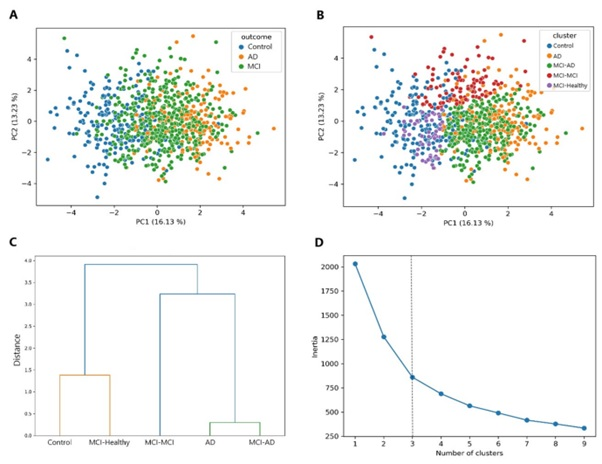

This repository contains source code for the paper titled **Mild cognitive impairment cases affect the predictive power of Alzheimer’s disease diagnostic models using routine clinical variables** . The aim of our study was to use machine learning to determine if easy-to-obtain clinical variables were diagnostic of MCI and AD.

#### SNAPSHOT OF THE RESEARCH
**Data and Participants:** This retrospective study used data generated from the Alzheimer’s Disease Neuroimaging Initiative (ADNI) cohort, publicly available at https://ida.loni.usc.edu/. Patients in the ADNI cohort were diagnosed as either cognitively healthy, mild cognitive impairment (MCI), or Alzheimer’s disease (AD) based on the presence of subjective memory complaints, an MMSE score, and CDR. We included continuous (e.g. weight, height, BMI, routine blood tests) and categorical (e.g. APOE genotype, physical exam) variables obtained at patients’ baseline visits that we determined would be appropriate for a primary care physician to complete (total = 120 variables). 

**Please note that dataset is available only via data use agreement with adni.** 

**Methods:** To determine the multi-classification diagnostic predictive value of the variables we used _CatBoost_. To identify the initial clustering patterns across healthy controls, MCI, AD we performed a principal component analysis (PCA). We then identified subclusters (subgroups) of MCI patients by taking principal component (PC) 1 and PC2 and using Gaussian mixture models for clustering. We confirmed these results using a hierarchical cluster dendrogram.

**Results:** _CatBoost_ models using 120 variables were able to readily identify healthy control and MCI patients but not those with AD. Feature selection slightly improved performance however our model was still unable to readily identify AD cases. 
Using CatBoost to perform a binary classification between healthy controls and AD patients, we showed that MCI cases, specifically, were driving poor AD predictive performance 
We found that there were three subtypes of MCI that differentially clustered with mostly healthy controls (MCI-Healthy), mostly AD patients (MCI-AD), or across both but more closely related to AD cases (MCI-MCI). 

<small>**Figure 1.** Identification of the distinct subgroups of MCI patients. (A) Principal component analysis showing clear separation between healthy control and AD patients but significant overlap of MCI. (B) Principal component analysis showing that MCI forms three distinct subclusters (MCI-Healthy, MCI-AD, and MCI-MCI) that have varying amounts of overlap with healthy control and AD. (C) Hierarchical cluster dendrogram showing that MCI-Healthy is closely related to healthy control, MCI-AD is closely related to AD and that MCI-MCI is distinct but more related to AD. (D) Elbow plot showing the relationship between the number of clusters and the within-cluster sum of squared distances (inertia). The dotted line represents the optimal number of clusters.  </small>

Clinical characteristics across the three subgroups of MCI were significantly different. There were also differences in likelihood of maintaining a stable MCI diagnosis, reverting to cognitively healthy, or progressing to AD over time. Here, the MCI-AD group was the least likely to remain stable or revert to cognitively healthy status and the most likely to progress to AD. We then identified that the MCI-AD subgroup, specifically, was driving poor predictive performance of our models.

**Conclusion:** We have identified that a particular subgroup of MCI affects the predictive performance of AD diagnostic models using primary care routine clinical variables. This subgroup (MCI-AD) was characteristically the most similar to AD and, in line with this, were significantly likely to progress to AD over time relative to the other MCI subgroups. These findings suggest that MCI-AD cases are likely representative of patients with prodromal AD. This work highlights the importance of AD diagnostic models focusing specifically on differentiating MCI cases from prodromal AD cases (who are also diagnosed as MCI) as the main way to improve their diagnostic predictive power and translatability.

